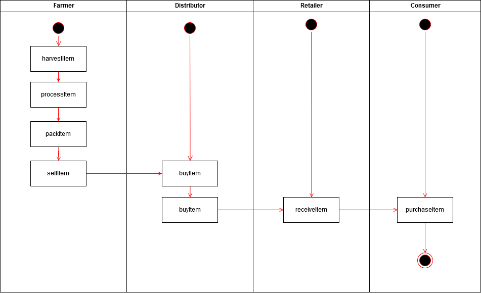
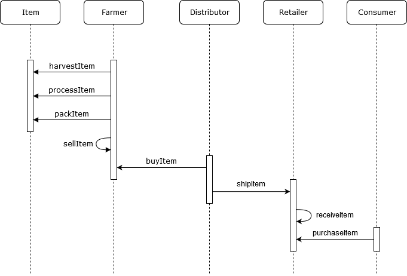
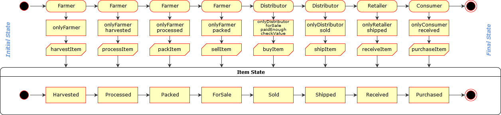
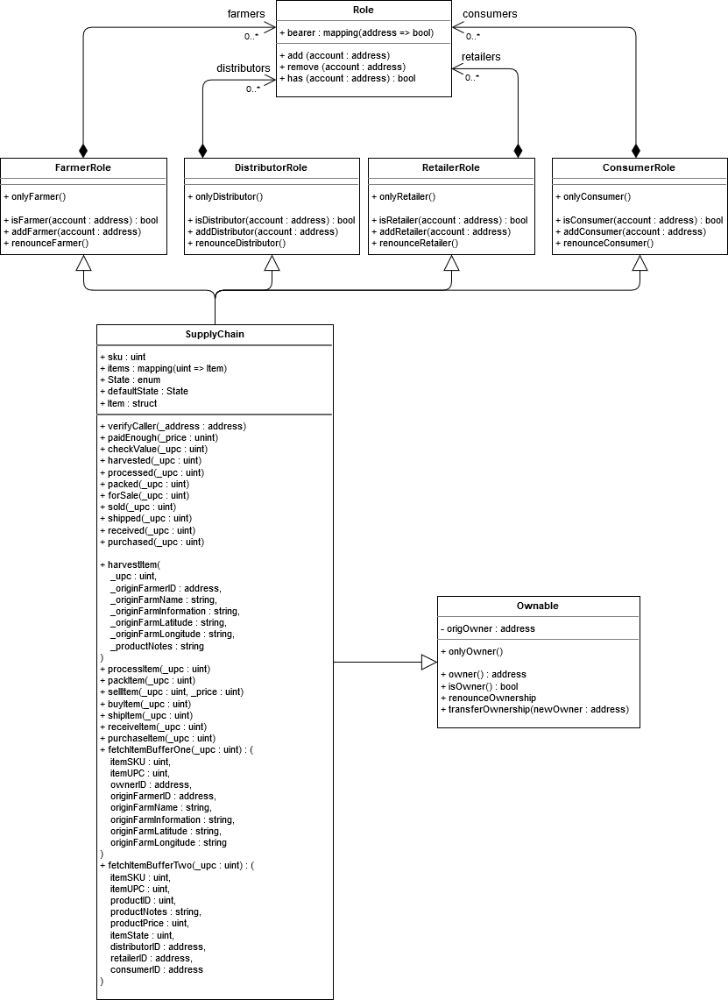
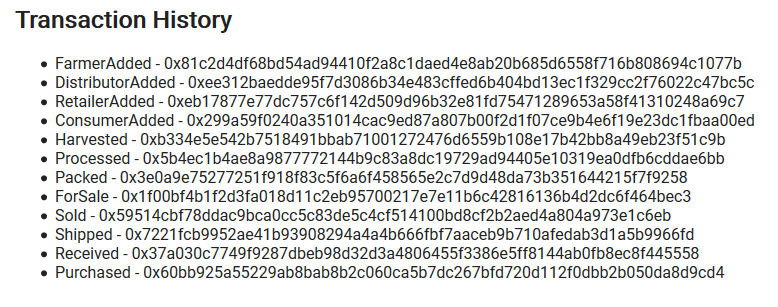

# Architect a Blockchain Supply Chain Solution

## Getting Started
Run `npm install` then `npm run dev` at the root of the project if you want to run the dapp locally.
- truffle version: 4.1.6
- node version: 8.9.4

### UML Diagrams
#### Activity

### Sequence

### State

### Classes (Data Model)

### Libraries
`truffle-hdwallet-provider` has been added to deploy the contract to `Rinkeby` and interact with it through the HDWalletProvider.

## Smart contract on Rinkeby
- Contract address: 0x12f541d9a807d97153a8e1aebec16f5e939243e3
- Contract creation tx hash: 0x2aa8ed64095ac752098820c918a67efb6e2952b9ba0b9c75d690b08450448b71

## Tx history of a product
UPC of the product is 998 and can be queried through the DAPP.  
Just enter 998 in the UPC field and then "Fetch Data 1" / " Fetch Data 2" with the appropriate buttons.

### Transaction History of UPC 998

- FarmerAdded - `0x81c2d4df68bd54ad94410f2a8c1daed4e8ab20b685d6558f716b808694c1077b`
- DistributorAdded - `0xee312baedde95f7d3086b34e483cffed6b404bd13ec1f329cc2f76022c47bc5c`
- RetailerAdded - `0xeb17877e77dc757c6f142d509d96b32e81fd75471289653a58f41310248a69c7`
- ConsumerAdded - `0x299a59f0240a351014cac9ed87a807b00f2d1f07ce9b4e6f19e23dc1fbaa00ed`
- Harvested - `0xb334e5e542b7518491bbab71001272476d6559b108e17b42bb8a49eb23f51c9b`
- Processed - `0x5b4ec1b4ae8a9877772144b9c83a8dc19729ad94405e10319ea0dfb6cddae6bb`
- Packed - `0x3e0a9e75277251f918f83c5f6a6f458565e2c7d9d48da73b351644215f7f9258`
- ForSale - `0x1f00bf4b1f2d3fa018d11c2eb95700217e7e11b6c42816136b4d2dc6f464bec3`
- Sold - `0x59514cbf78ddac9bca0cc5c83de5c4cf514100bd8cf2b2aed4a804a973e1c6eb`
- Shipped - `0x7221fcb9952ae41b93908294a4a4b666fbf7aaceb9b710afedab3d1a5b9966fd`
- Received - `0x37a030c7749f9287dbeb98d32d3a4806455f3386e5ff8144ab0fb8ec8f445558`
- Purchased - `0x60bb925a55229ab8bab8b2c060ca5b7dc267bfd720d112f0dbb2b050da8d9cd4`
